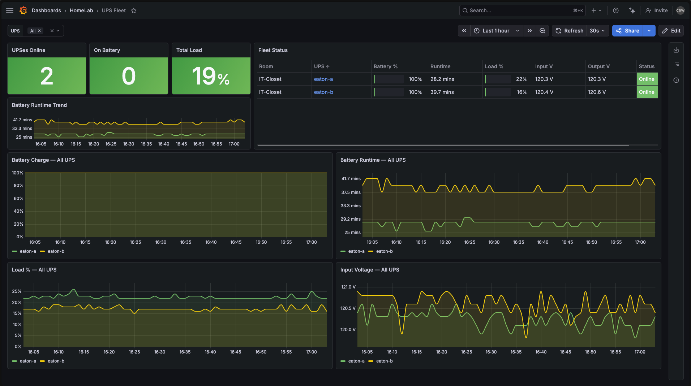
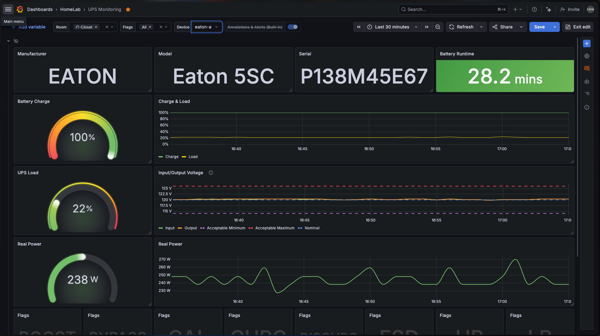

# ups-o11y

UPS monitoring stack using [NUT](https://networkupstools.org/), [nut_exporter](https://github.com/DRuggeri/nut_exporter), [Grafana Alloy](https://grafana.com/docs/alloy/), and Grafana Cloud. Built around two Eaton 5SC 1500s on a Raspberry Pi, but it works with any USB UPS that NUT supports.



## What's here

```
nut/                    NUT server install script + config files
nut-exporter/           nut_exporter v3.2.5 install script + systemd unit
alloy/nut.alloy         Alloy scrape fragment (drop into /etc/alloy/)
grafana/dashboard.json  Per-device UPS dashboard
grafana/fleet-dashboard.json  Fleet overview — one row per UPS
grafana/alerts.yaml     8 alert rules
grafana/deploy.sh       Push dashboards + alerts to Grafana Cloud via API
ansible/                Full Ansible role targeting Ubuntu 24.04
```

## Prerequisites

- Ubuntu 24.04 or Raspberry Pi OS Bookworm
- UPS connected via USB
- Grafana Alloy running with a `prometheus.remote_write "metrics_service"` component
- Grafana Cloud account (free tier is fine)

## Quickstart

**Bash:**

```bash
git clone https://github.com/colinedwardwood/ups-o11y.git && cd ups-o11y

# NUT — generates a password if you don't set one
NUT_PASSWORD="$(openssl rand -base64 24)" sudo -E bash nut/install-nut.sh
upsc eaton@localhost   # verify

# nut_exporter — auto-detects amd64/arm64/arm
sudo bash nut-exporter/install-nut-exporter.sh
curl -s 'http://localhost:9199/ups_metrics?ups=eaton' | grep battery_charge

# Alloy scrape config — edit room label and ups names to match your setup
sudo cp alloy/nut.alloy /etc/alloy/nut.alloy
sudo systemctl reload alloy

# Grafana dashboards + alerts
GRAFANA_TOKEN=<your-api-key> GRAFANA_URL=https://yourinstance.grafana.net bash grafana/deploy.sh
```

**Ansible:**

```bash
cp ansible/inventory.example.ini ansible/inventory.ini
# edit inventory.ini with your host
ansible-playbook -i ansible/inventory.ini ansible/playbook.yml \
  --extra-vars "nut_password=$(openssl rand -base64 24)"
```

See [ansible/README.md](ansible/README.md) for vault usage and variable reference.

## Multiple UPS devices

If you have more than one UPS on the same host, use `serial` in `ups.conf` to pin each device — USB enumeration order isn't stable across reboots:

```
[eaton-a]
  driver = usbhid-ups
  port   = auto
  serial = P138M45E67

[eaton-b]
  driver = usbhid-ups
  port   = auto
  serial = P138M45E49
```

The Alloy fragment and Ansible role both handle multiple devices. See `alloy/nut.alloy` for the two-scrape pattern and `ansible/host_vars/` for an example.

## Security

- `upsd` listens on `127.0.0.1` only — port 3493 isn't exposed on the network
- `NUT_PASSWORD` is never hardcoded — the install script reads it from env and generates one if missing
- nut_exporter runs as a dynamically-allocated unprivileged user (`DynamicUser=yes`) with a restricted systemd sandbox
- Alloy credentials use `sys.env()` — not plaintext in config files

## Alerts

| Alert | When | Severity |
|---|---|---|
| UPS On Battery | `flag="OB"` for 1 min | critical |
| UPS Low Battery | `flag="LB"` | critical |
| NUT Exporter Down | `up == 0` for 3 min | critical |
| Battery Charge Critical | `< 25%` for 5 min | warning |
| Battery Runtime Low | `< 5 min` for 2 min | warning |
| Battery Needs Replacement | `flag="RB"` for 10 min | warning |
| UPS Overloaded | `flag="OVER"` for 2 min | warning |
| Input Voltage Anomaly | outside 108–132 V for 5 min | warning |

## Dashboards

Two dashboards are included. `grafana/deploy.sh` pushes both.

**Per-device view** — manufacturer, model, serial, runtime stat, battery charge gauge, charge & load trends, input/output voltage with acceptable range bands, real power gauge and trend, UPS status flags.



**Fleet view** — summary stats (online count, on-battery count, total load), a table with one row per UPS showing battery %, runtime, load %, input/output voltage, and status — plus overlaid time series for all devices.

## Tested with

- Eaton 5SC 1500 (`usbhid-ups` driver) × 2
- Raspberry Pi 5, Ubuntu 24.04 arm64
- nut_exporter v3.2.5 / Grafana Alloy v1.x
